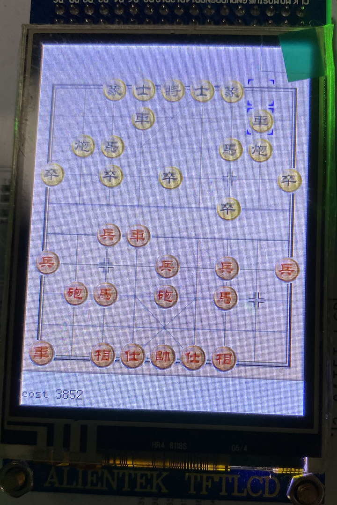
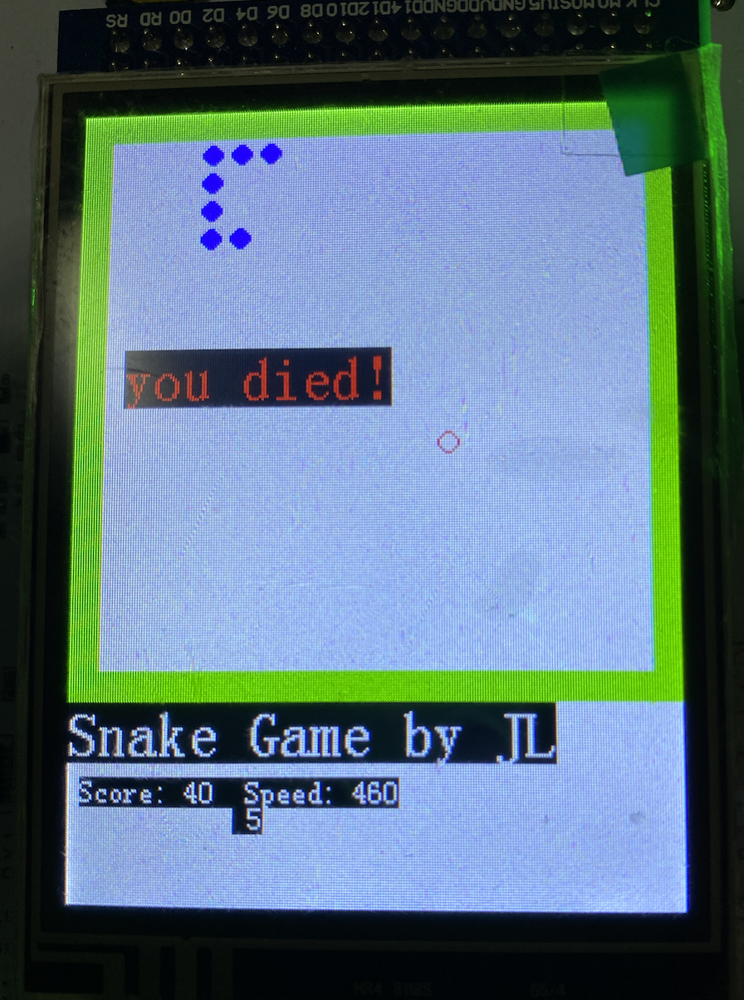

# Learn STM32

杭电嵌入式学习代码，基于 PlatformIO 平台。

**为何会有此仓库？**

- [嵌入式开发环境搭建，我是如何拯救我的MacBook的?](https://www.yuque.com/dreamer2q/learning/stm32-env)

## 配置

开发板参数

- stm32f103vct6

开发环境

- macbook m1
- vscode
- PlatformIO


## 目录结构

```tree
.
├── materials  //参考资料、学习材料，介绍实验开发板基本情况
└── projects   //学习练手项目，里面包括大部分实验内容
    ├── cchess //中国象棋大作业 platformio 项目工程
    │   ├── engine // 象棋AI引擎，eleeye移植
    │   │   ├── adaptor // serial 串口适配器用于和开发板通讯
    │   │   ├── base
    │   │   ├── book
    │   │   ├── eleeye
    │   │   └── include
    │   ├── include  // platformIO 头文件
    │   ├── lib
    │   ├── src
    │   │   ├── FWlib  // stm32 标准库
    │   │   │   ├── inc
    │   │   │   └── src
    │   │   ├── GAME  // 游戏逻辑部分
    │   │   │   ├── CChess // 象棋
    │   │   │   │   └── resource // 游戏图片资源
    │   │   │   └── Snake // 简陋的贪吃蛇
    │   │   ├── LCD // LCD 驱动
    │   │   └── SYS // printf,scanf 适配
    │   └── test
    └── template
```

## Projects 介绍

### CChess 中国象棋

象棋游戏，支持
- 人vs人
- 人vs电脑(通过串口通讯)

游戏引擎移植开源的“eleeye”，通过“UCCI”协议进行交互。

有关更多介绍，参见“cchess/engine”里面的内容。




### Snake 贪吃蛇

非常简陋的贪吃蛇游戏，用于测试 LCD 编写。



